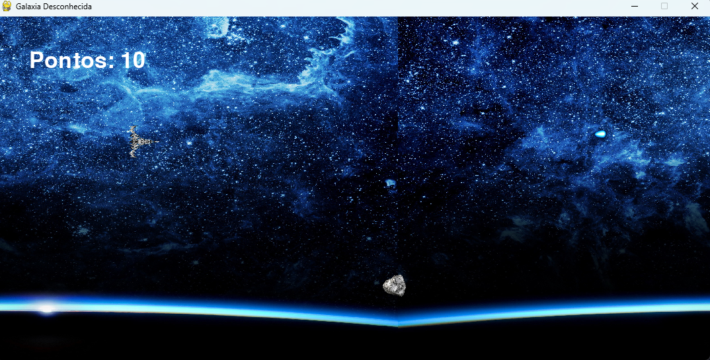
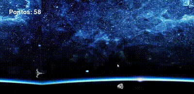

<h1 align="center"> Galáxia Desconhecida: Projeto de Computação Gráfica e Realidade Virtual </h1>

<p align="center">
Projeto acadêmico proposto pela Universidade São Judas Tadeu para a Unidade Curricular <strong>Computação Gráfica e Realidade Virtual</strong>. <br/>
Explorando texturas e materiais para criar uma experiência de jogo imersiva!
</p>

<p align="center">
  <a href="#-tecnologias-utilizadas">Tecnologias</a>&nbsp;&nbsp;&nbsp;|&nbsp;&nbsp;&nbsp;
  <a href="#-objetivo-da-atividade">Objetivo</a>&nbsp;&nbsp;&nbsp;|&nbsp;&nbsp;&nbsp;
  <a href="#-proposta-de-desenvolvimento">Proposta de Desenvolvimento</a>&nbsp;&nbsp;&nbsp;|&nbsp;&nbsp;&nbsp;
  <a href="#-como-executar-o-projeto">Execução</a>
</p>

<p align="center">
  
</p>

## 🚀 Tecnologias Utilizadas

Esse projeto foi desenvolvido com as seguintes tecnologias:

- **Python 3.x**: Lógica de programação do jogo.
- **Pygame**: Biblioteca para gráficos 2D, manipulação de sprites e colisões.
- **Ferramentas de Edição de Imagem**: Criação e edição das texturas aplicadas.

## 🎯 Objetivo da Atividade

A proposta desafia os alunos a criarem um jogo espacial, o **Galáxia Desconhecida**, com alta qualidade visual, texturas realistas, materiais detalhados, mapeamento UV e iluminação dinâmica. Inspirado nos desafios da equipe fictícia "VirtualVista Games", o jogo visa simular um ambiente espacial imersivo, combinando técnicas avançadas de computação gráfica podendo ser projetada emm 2D ou 3D.

## 💡 Proposta de Desenvolvimento

1. **Texturização Avançada**: Aplicação de texturas detalhadas nos asteroides, nave e ambiente espacial.
2. **Materiais PBR (Physically Based Rendering)**: Simulação realista das superfícies para maior fidelidade visual.
3. **Mapeamento UV**: Garantia de precisão no ajuste das texturas aos objetos do jogo.
4. **Iluminação Dinâmica**: Criação de efeitos de luz que variam com os movimentos e posições dos elementos na tela.

## 📖 Enunciado da Atividade

A equipe da "VirtualVista Games" está desenvolvendo o jogo **Galáxia Desconhecida**, explorando o potencial das texturas e materiais na criação de ambientes imersivos. Neste projeto, o objetivo é aplicar as seguintes técnicas:

- Texturização avançada em ambientes espaciais.
- Uso de materiais PBR para superfícies realistas.
- Mapeamento UV preciso.
- Iluminação dinâmica para uma experiência cativante.

## 🕹️ Como Executar o Projeto

1. Clone o repositório:
    ```bash
    git clone https://github.com/usuario/galaxia-desconhecida.git
    ```
2. Instale a biblioteca `pygame`:
    ```bash
    pip install pygame
    ```
3. Execute o jogo:
    ```bash
    python jogo_galaxia_desconhecida.py
    ```

## 🎥 Demonstração do Jogo



---

Desenvolvido com ♥ como parte do estudo de caso da UC **Computação Gráfica e Realidade Virtual** da Universidade São Judas Tadeu.
